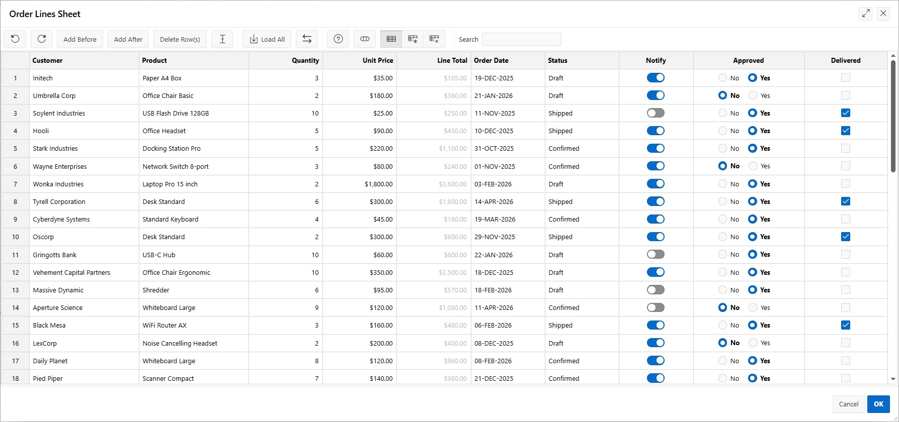

# apex-ig-spreadsheet-view
Adds a Spreadsheet View to Interactive Grids for fast data editing, with support for copy-and-paste to and from Excel.

### Configuration in Page Designer
To configure, create a new Region and select 'LIB4X - IG Spreadsheet View' as the Region Type. Select 'Inline Dialog' as the template. Select 'Dialogs, Drawers and Popups' as the Slot. On the Region Attributes, select for which IG/IG's you want to enable the Spreadsheet View.

In the IG toolbar, and extra item will show up, which starts the Spreadsheet View in a Modal Dialog.

### Usage
The Spreadsheet View loads with a copy of the Grid data. You can edit it, add/delete rows, and copy/paste from and to Excel. Upon 'OK', the changes are synchronized back to the Grid. In the Grid, you can address any issues like validation errors and then save the data.

Upon selecting a cell, you can directly start typing to replace any current value. Or double-click or use F2 to change the existing value.

You can use the other familiar spreadsheet type of editing features like selecting cell(s), copy them and paste the values elsewhere. Or use the Fill Handle (bottom-right corner of a selection) to copy or fill into adjacent cells. You can also use copy-and-paste to/from Excel.

<ins>Edit on Focus</ins>: this button enables you to edit cells without need to first use F2 or double click.

<ins>Load All</ins>: initially, a subset of data might have been loaded only. Use this button to load all the data. It loads to a maximum of 5000 rows (configurable).

<ins>Synchronize</ins>: this button lets you synchronize your changes in between with the Grid without closing the dialog. Any resulting validation errors will be marked and shown in the spreadsheet.

Ctrl+Z/Ctrl+Y: shortcut keys for Undo/Redo. This will apply to changes which haven't been synchronized to the Grid yet.

